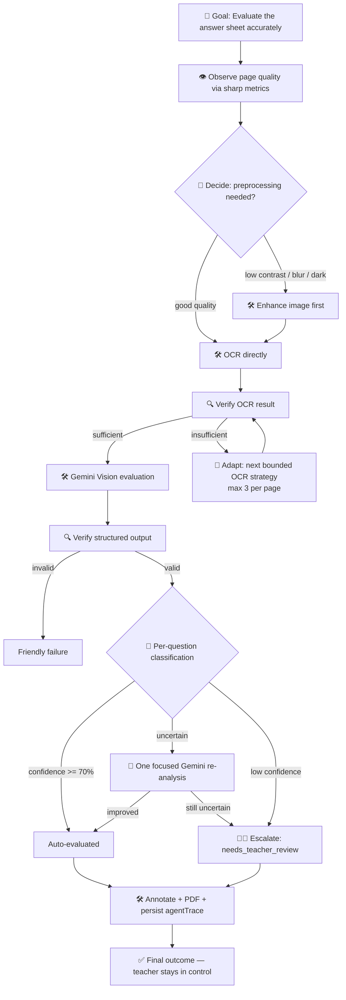

# EvalAI

EvalAI is an AI-powered answer-sheet evaluation platform. Students upload handwritten answer sheets (scans or photos, HEIC included) and an AI pipeline reads the handwriting, evaluates every answer against the subject's knowledge, marks corrections directly on the pages like a real teacher, and produces a corrected PDF — with teachers in full control to review, adjust, and publish the final marks.

## Features

- **AI Evaluation Studio** — a 6-step pipeline (upload → OCR → AI evaluation → annotation → feedback → download) with live progress over WebSockets.
- **Real handwriting OCR** — Google Vision `DOCUMENT_TEXT_DETECTION` when `GOOGLE_API_KEY` is set, Tesseract fallback otherwise.
- **Gemini Vision evaluation** — no answer key needed; the model reads the handwriting from the images, grades each question (`correct` / `partial` / `incorrect` / `unattempted`), assigns marks, and explains reasoning.
- **On-page teacher annotation** — ticks, crosses, circles, underlines, highlights and handwritten corrections are drawn directly onto the sheet images (normalized coordinates → pixel rendering).
- **Corrected PDF report** — annotated pages compiled into a single PDF with `pdfkit`; originals are never modified.
- **Role-based workspaces** — Student, Teacher, and Admin dashboards with JWT + role-guarded routes.
- **Teacher review & publish** — AI results are a draft; teachers review each submission, edit marks/feedback/remarks, then publish.
- **Real-time notifications** — Socket.IO progress events and new-notification pushes.
- **Demo accounts** — seeded automatically on server boot (idempotent).

## Tech Stack

| Layer     | Technology |
|-----------|-----------|
| Frontend  | React 19, Vite 8, Tailwind CSS 4, React Router 7, TanStack React Query 5, Axios, react-hook-form + Zod, react-dropzone, Recharts, Framer Motion, Sonner, Socket.IO client |
| Backend   | Node.js, Express 5, Mongoose (MongoDB), Redis (ioredis), Socket.IO, sharp, pdfkit, Tesseract.js, Winston |
| AI        | Google Gemini API (`gemini-2.5-flash` default), Google Vision OCR API |
| Auth      | JWT (access + refresh), bcrypt, role-based middleware |

## Project Structure

```
EvalAI/
├── backend/                  # Express API + evaluation pipeline
│   ├── src/
│   │   ├── app.js            # Express app: middleware, routes, rate limits
│   │   ├── server.js         # Bootstrap: DB, Redis, sockets, graceful shutdown
│   │   ├── config/           # env, MongoDB, Redis
│   │   ├── models/           # User, Submission, Assignment, Evaluation, Notification
│   │   ├── routes/           # auth, evaluation, student, teacher, admin, notifications
│   │   ├── services/         # evaluation pipeline, OCR, Gemini, annotation, storage, ...
│   │   ├── sockets/          # Socket.IO (evaluation progress, notifications)
│   │   ├── middlewares/      # JWT auth, role guards, error handling
│   │   └── utils/            # logger, JWT, file storage, PDF report builder
│   └── uploads/              # Generated evaluation files (gitignored)
└── Frontend/                 # React SPA
    └── src/
        ├── app/              # Router + App entry
        ├── context/          # AuthContext (JWT, user hydration)
        ├── hooks/            # useAuth, useMediaQuery, useHotkey, ...
        ├── pages/            # auth/, student/, teacher/, admin/, evaluation/
        ├── components/       # layout, routing, ui, charts, feedback, animations
        ├── services/         # apiClient, auth, submissions, evaluations, socket
        └── constants/ config/ utils/
```

## Getting Started

### Prerequisites

- Node.js 18+ (Vite 8 / Express 5)
- MongoDB (or MongoDB Atlas) — optional; the server falls back to an in-memory store if unreachable
- Redis — optional (`REDIS_ENABLED=false` skips it)
- Google AI Studio API key for Gemini evaluation, Google Cloud Vision key for OCR (both optional — the pipeline degrades gracefully without them)

### 1. Backend

```bash
cd backend
npm install
copy .env.example .env   # or create .env — see Environment Variables below
npm run dev              # nodemon on http://localhost:5000
```

### 2. Frontend

```bash
cd Frontend
npm install
npm run dev              # Vite on http://localhost:5173
```

The Vite dev server proxies `/api`, `/uploads`, and `/socket.io` (with WebSockets) to `http://localhost:5000`.

Open http://localhost:5173 — signed-out users land on the login page.

### Demo Accounts

Seeded automatically on server boot (idempotent — never duplicated):

| Role    | Email                  | Password      |
|---------|------------------------|---------------|
| Teacher | teacher@evalai.com     | Teacher@123   |
| Student | student@evalai.com     | Student@123   |

## Environment Variables

All optional values have sensible defaults in `backend/src/config/env.js`.

| Variable | Description | Default |
|----------|-------------|---------|
| `NODE_ENV` | Runtime environment | `development` |
| `PORT` | API port | `5000` |
| `CLIENT_URL` | Allowed CORS origin | `http://localhost:5173` |
| `MONGO_URI` | MongoDB connection string | `mongodb://localhost:27017/evalai` |
| `REDIS_ENABLED` | Enable Redis (`true`/`false`) | `false` |
| `REDIS_URL` | Redis connection string | `redis://localhost:6379` |
| `JWT_ACCESS_SECRET` / `JWT_REFRESH_SECRET` | JWT signing secrets | dev defaults |
| `JWT_ACCESS_EXPIRES_IN` / `JWT_REFRESH_EXPIRES_IN` | Token lifetimes | `15m` / `7d` |
| `GOOGLE_API_KEY` | Google Vision OCR key (document text detection) | unset → Tesseract |
| `GEMINI_API_KEY` | Google AI Studio key for evaluation | unset → degraded mode |
| `GEMINI_MODEL` | Gemini model used for evaluation | `gemini-2.5-flash` |
| `UPLOAD_DIR` | Directory for generated evaluation files | `uploads` |
| `MAX_SHEETS_PER_EVALUATION` | Page limit per evaluation | `50` |
| `SMTP_HOST/PORT/USER/PASS` | Email transport (password reset) | Gmail defaults |
| `CLOUDINARY_*` | Optional Cloudinary storage | unset → local disk |

## Evaluation Pipeline

The core lives in `backend/src/services/evaluation.service.js` (`runEvaluation`):

1. **Prepare** — uploaded pages are normalized with `sharp`: EXIF rotation, capped at 1800px, converted to PNG (HEIC/HEIF decoded too).
2. **OCR** — every page is read (Google Vision if configured, Tesseract otherwise); if no text is found on any page the evaluation fails with a friendly `422`.
3. **Evaluate** — page images are sent to Gemini Vision in batches (max 8 pages/request) with a detailed teacher prompt; the model reads the handwriting, detects every question, judges each answer semantically, assigns marks and confidence, and returns bounding boxes for annotations. Transient failures retry with exponential backoff.
4. **Annotate** — marks are rendered onto the pages (`annotation.service.js`): green ticks for correct, crosses, circles/underlines/highlights on the specific wrong regions, plus the teacher's short comments and correction notes.
5. **Report** — original + annotated page images and a compiled `corrected-sheets.pdf` are stored in `uploads/<evaluationId>/`; the full record (questions, marks, feedback, per-page OCR text, URLs) is persisted.
6. **Publish** — progress is streamed to the client over Socket.IO (`evaluation:progress`, room per evaluation), and the teacher reviews/publishes the result.

## Agentic Evaluation Architecture

The evaluation pipeline is orchestrated by a genuine **Agentic Evaluation Controller** (`backend/src/services/agent/evaluationAgent.service.js`) instead of a fixed, blind sequence. The agent follows the loop:

```text
🎯 GOAL → 👁 OBSERVE → 🧠 DECIDE → 🛠 ACT → 🔍 VERIFY → 🔄 ADAPT → 👨‍🏫 ESCALATE → ✅ FINAL OUTCOME
```



### Goal
Evaluate handwritten answer sheets accurately while adapting to unreliable inputs — never silently grading what the system cannot read confidently.

### Observe
- Deterministic page-quality metrics per page via the existing `sharp` dependency (`observation.service.js`): dimensions, brightness, contrast, entropy → `low_contrast`, `possible_blur`, `too_dark`, `nearly_blank`, `low_resolution`.
- Real OCR results (text present, length, provider confidence where it actually exists).
- Structured Gemini evaluation results (questions, marks ranges, confidence).

### Decide
Deterministic rules (`decision.service.js`), based only on actual observations:
- **Preprocessing**: enhance (grayscale contrast stretch + sharpen) only when the page quality observation flags issues; good pages are OCR'd directly.
- **OCR strategy**: a bounded plan — default chain → enhanced image → alternate provider (max **3 strategies per page**).
- **Retry**: Gemini transient failures reuse the existing exponential-backoff `withRetry`.
- **Question strategy**: `AUTO_EVALUATED` (confidence ≥ 0.7), `NEEDS_ADDITIONAL_ANALYSIS` (one focused Gemini Vision re-read of the question's page), or `NEEDS_TEACHER_REVIEW` (≤ 0.4 or unreadable answer).
- **Escalation**: unresolved questions/pages are flagged `needs_teacher_review` — the agent never invents a grade.

### Act
The existing services act as the agent's tools — no duplicated functionality:
- Image processing (`evaluation.service.normalizePageImage`, agent `enhancePageImage`)
- OCR (`ocr.service`: Google Vision / Tesseract)
- Gemini evaluation (`gemini-evaluate.service`)
- Annotation (`annotation.service`)
- PDF + persistence (`storage.service`, corrected PDF builder)

### Verify
Every major action is verified (`verification.service.js`): OCR text presence/meaningfulness/confidence (never fabricated — Tesseract's real 0-100 score is used when available, Google Vision only exposes a presence flag), structured evaluation validity (questions detected, pages in range, marks within bounds), and annotation output completeness.

### Adapt
When verification fails, the agent visibly adapts — switches OCR strategy, retries with an enhanced image, re-analyzes an uncertain question — all bounded (max 3 OCR strategies/page, max 5 question re-checks per evaluation) and recorded in the trace.

### Escalate
Unresolved questions get `needsTeacherReview: true` + a human-readable `reviewReason`, the evaluation record gets status `needs_teacher_review` with an `agentOutcome` summary, and the teacher remains the final authority (review, edit marks/feedback, publish — unchanged).

### Trace
Every observation, decision, action, verification, adaptation and escalation is stored as a concise `agentTrace` entry on the evaluation record (Mongo/JSON fallback) and streamed live over Socket.IO (`agent:trace` events). The frontend renders this as the **Agent Activity Timeline** in the evaluation studio, alongside the existing 6-step pipeline UI — no chain-of-thought or prompts are exposed, only what actually happened.

## API Overview

All routes are under `/api` and rate-limited (1000 req / 15 min). Protected routes require `Authorization: Bearer <access-token>`.

| Route group | Purpose |
|-------------|---------|
| `POST /api/auth/register` `login` `logout`, `GET /api/auth/me`, `POST /api/auth/forgot-password` `reset-password` | Authentication |
| `POST /api/evaluation/evaluate` | Multipart evaluation upload (runs the full pipeline) |
| `GET /api/student/dashboard` `submissions` `results`, `GET /api/student/results/:id` | Student workspace |
| `GET /api/teacher/dashboard` `submissions` `submission/:id` `students` `analytics`, `PUT /api/teacher/evaluate/:id` | Teacher workspace |
| `GET /api/admin/dashboard` | Admin platform stats |
| `GET /api/notifications` | Notifications |

Other endpoints: `GET /health` (health check), `GET /uploads/*` (static generated files).

## Scripts

| Command | Where | What |
|---------|-------|------|
| `npm run dev` | backend/ | Start API with nodemon |
| `npm run start` | backend/ | Start API without reload |
| `npm run seed:admin` | backend/ | Seed the admin account |
| `npm run dev` | Frontend/ | Start Vite dev server |
| `npm run build` | Frontend/ | Production build |
| `npm run preview` | Frontend/ | Preview the production build |
| `npm run lint` | Frontend/ | Oxlint |

## Notes

- The `@` import alias in the frontend resolves to `Frontend/src`.
- Authentication uses JWT access + refresh tokens; the frontend persists `evalai-access-token` in localStorage and hydrates the session via `GET /api/auth/me`.
- Generated files live under `backend/uploads/` (gitignored).
- `eng.traineddata` at the repo root and in `backend/` is Tesseract language data (used by the OCR fallback).
